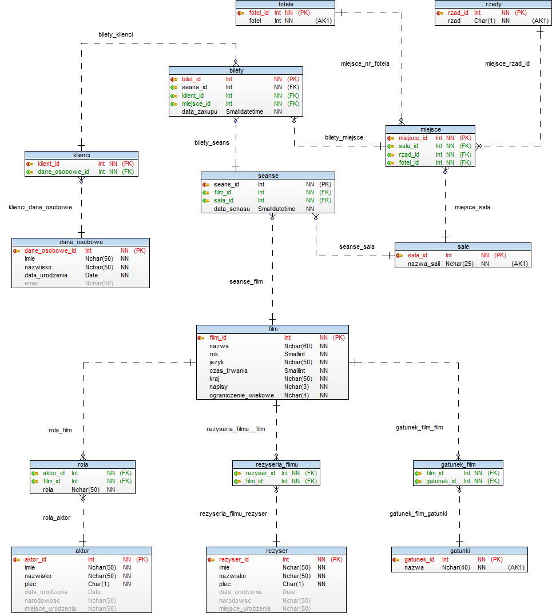

### Koncepcja projektu 

Przedstawiona baza danych umożliwia tworzenie zbiorów danych związanych z funkcjonowaniem prostego kina. Pozwala ona potencjalnemu klientowi na zakup biletu na wybrany seans filmowy. Każdy seans charakteryzuje się konkretnym filmem, salą w jakiej jest wyświetlany oraz konkretną datą w jakiej odbywa się dany seans. Klient kupując bilet na wybrany seans może wybrać miejsce siedzące w jakim chce usiąść (na jedno miejsce składa się kombinacja danego rzędu oraz numeru fotela). Klient szukając seansu, na który chciałby się wybrać, może również wyszukiwać interesujący go film nie tylko po samym tytule, ale również po ulubionych aktorach, reżyserach czy też gatunkach filmowych. Trzy powyższe informacje są mu udostępniane, dzięki czemu klient może filtrować interesujące go seanse, nie znając konkretnych filmów, posiadając natomiast preferencje dotyczące gatunków, ulubionych aktorów czy też reżyserów. 
Po znalezieniu interesującego go filmu, potencjalny nabywca naszej usługi otrzymuje informacje takie jak język filmu, dostępność napisów, ograniczenia wiekowe, kraj produkcji czy też czas trwania. Kupując bilet klient jest zobowiązany do wprowadzenia przynajmniej trzech informacji: imienia, nazwiska oraz daty urodzenia.

#### Ogólne założenia dotyczące bazy:

-  Konieczność podania przynajmniej podstawowych danych osobowych przez klienta chcącego zakupić bilet na wybrany seans (imię, nazwisko, data urodzenia).
-  Każda sala znajdująca się w kinie jest tej samej wielkości (rząd * fotel)-  Bilet na wybrany seans musi być zapłacony z góry, dlatego też nie ma możliwości „rezerwacji” miejsca. Nie znajdziemy poprzez to również informacji o statusie biletu.

#### Dostęp do informacji:

-  Klient ma możliwość dostępu do informacji na temat filmu takich jak: język filmu, czas trwania, ograniczenia wiekowe, dostępność napisów, gatunek filmu, przejrzenie dorobku reżysera danego filmu, przejrzenie historii występów aktorów występujących w filmie.
-  Dla strony obsługi technicznej kina, baza umożliwia dostęp do wszechstronnych informacji zarówno od strony biznesowej, jak i technicznej kina.

    - Strona biznesowa: preferencje klientów (jakie seanse, kiedy oraz w jakich   porach, w jakich miejscach w sali)

    - Strona techniczna: dostępność miejsca na dane seanse, informacje na temat biletów oraz samych seansów, wyświetlanie filmów oraz powiązań jakie mu towarzyszą.

#### Diagram przedstawiający omawianą bazę danych:

#### Opis tabel

- Tabela: ___filmy___: 
Odpowiedzialna jest za przechowywanie informacji na temat filmów, które wyświetlane są w kinie, składa się ona z następujących pól:

    - film_id - klucz podstawowy w tabeli filmy, autonumerowany typu INT.
    - nazwa - pole typu NCHAR z ograniczeniem do 60 znaków, oraz wymagalnością. Odpowiada za tytuł filmu.
    - rok - pole typu SMALLINT z wymagalnością, oraz warunkiem sprawdzającym, aby wartość była większa niż 0. Odpowiada za rok premiery filmu.
    - jezyk - pole typu NCHAR z ograniczeniem do 50 znaków oraz wymagalnością. Odpowiada za język wyświetlanego filmu.
    - czas_trwania - pole typu SMALLINT z wymagalnością, oraz warunkiem sprawdzającym aby wartość była większa od 0. Odpowiada za czas trwania filmu (w minutach).
    - kraj - pole typu NCHAR z ograniczeniem do 50 znaków oraz wymagalnością. Odpowiada za kraj produkcji filmu.
    - napisy - pole typu NCHAR z ograniczeniem do 3 znaków, wymagalnością oraz warunkiem sprawdzającym dopuszczającym jedynie dwie wartości z podanej krotki (‘TAK’ lub ‘NIE’).
    - ograniczenie_wiekowe - pole typu NCHAR z ograniczeniem do 4 znaków, wymagalnością oraz warunkiem sprawdzającym dopuszczającym jedynie cztery wartości z podanej krotki (‘16’, ‘18’, ‘12’, ‘Brak’).

- Tabela: ___aktor___:
Odpowiedzialna za przechowywanie informacji na temat aktorów występujących w filmach. Jest ona potrzebna dla użytkowników kina, którzy poszukują filmów z konkretnymi aktorami w niej występującymi. Składa się z następujących pól:

    - aktor_id - klucz podstawowy w tabeli aktor, autonumerowany typu INT.
    - imie - pole typu NCHAR z ograniczeniem do 50 znaków, oraz wymagalnością. Odpowiada za imię aktora.
    - nazwisko - pole typu NCHAR z ograniczeniem do 50 znaków, oraz wymagalnością. Odpowiada za nazwisko aktora.
    - plec - pole typu CHAR z ograniczeniem do 1 znaku, wymagalnością oraz warunkiem sprawdzającym dopuszczającym jedynie dwie wartości z podanej krotki (‘M’, ‘K’). Odpowiada za płeć aktora.
    - data_urodzenia - pole typu DATE. Odpowiada za datę urodzenia aktora – nie wymagane.
    - narodowosc - pole typu NCHAR z ograniczeniem do 50 znaków. Odpowiada za narodowość aktora - nie jest wymagane.
    - miejsce_urodzenia - pole typu NCHAR z ograniczeniem do 50 znaków. Odpowiada za miejsce urodzenia aktora - nie jest wymagane.

- Tabela: ___rezyser___:
Odpowiedzialna za przechowywanie informacji na temat reżyserów filmów. Jest ona potrzebna dla użytkowników kina, mających swoich ulubionych reżyserów i szukających filmów zrobionych właśnie przez nich. Składa się z następujących pól:

    - rezyser_id - klucz podstawowy w tabeli rezyser, autonumerowany typu INT.
    - imie - pole typu NCHAR z ograniczeniem do 50 znaków, oraz wymagalnością. Odpowiada za imię reżysera.
    - nazwisko - pole typu NCHAR z ograniczeniem do 50 znaków, oraz wymagalnością. Odpowiada za nazwisko reżysera.
    - plec - pole typu CHAR z ograniczeniem do 1 znaku, wymagalnością oraz warunkiem sprawdzającym dopuszczającym jedynie dwie wartości z podanej krotki (‘M’, ‘K’). Odpowiada za płeć reżysera.
    - data_urodzenia - pole typu DATE. Odpowiada za datę urodzenia reżysera – nie wymagane.
    - narodowosc - pole typu NCHAR z ograniczeniem do 50 znaków. Odpowiada za narodowość reżysera - nie jest wymagane.
    - miejsce_urodzenia - pole typu NCHAR z ograniczeniem do 50 znaków. Odpowiada za miejsce urodzenia reżysera - nie jest wymagane.

- Tabela: ___rola___:
Odpowiedzialna za logiczne i płynne połączenie tabeli aktor z tabelą film poprzez dwa pola aktor_id oraz film_id. Składa się z następujących pół:

    - aktor_id - pole typu INT z wymagalnością, klucz obcy odnoszący się do aktor_id w tabeli aktor.
    - film_id - pole typu INT z wymagalnością, klucz obcy odnoszący się do film_id w tabeli film.
    - rola - pole typu NCHAR z ograniczeniem do 50 znaków, oraz wymagalnością. Odpowiada za rolę jaką gra dany aktor w konkretnym filmie.

- Tabela: ___rezyseria_filmu___:
Odpowiedzialna za logiczne i płynne połączenie tabeli rezyser z tabelą film poprzez dwa pola reżyser_id oraz film_id . Składa się z następujących pól:

    - rezyser_id - pole typu INT z wymagalnością, klucz obcy odnoszący się do rezyser_id w tabeli reżyser.
    - film_id - pole typu INT z wymagalnością, klucz obcy odnoszący się do film_id w tabeli film.

- Tabela: ___gatunki___:
Odpowiedzialna za przechowywanie wszystkich dostępnych gatunków filmów. Składa się z następujących pół:

    - gatunek_id - klucz podstawowy w tabeli gatunki, autonumerowany typu INT.
    - nazwa - pole typu NCHAR z ograniczeniem do 40 znaków, wymagalnością oraz unikalnością. Odpowiada za nazwę gatunku filmowego.

- Tabela: ___gatunek_film___:
Odpowiedzialna za logiczne i płynne połączenie tabeli gatunki z tabelą film poprzez dwa pola gatunek_id oraz film_id . Składa się z następujących pól:

    - film_id - pole typu INT z wymagalnością, klucz obcy odnoszący się do film_id w tabeli film.
    - gatunek_id - pole typu INT z wymagalnością, klucz obcy odnoszący się do gatunek_id w tabeli gatunki.

- Tabela: ___sale___:
Odpowiedzialna za przechowywanie informacji dotyczących sal występujących w kinie. Składa się z następujących pól:

    - sala_id - klucz podstawowy w tabeli sale, autonumerowany typu INT.
    - nazwa_sali - pole typu NCHAR z ograniczeniem do 25 znaków, wymagalnością oraz unikalnością. Odpowiada za nazwę danej sali kinowej.

- Tabela: ___seanse___:
Odpowiedzialna za przechowywanie informacji dotyczących konkretnego seansu filmowego. Określa ona jeden unikalny seans filmu, w konkretnym terminie. Składa się z następujących pól:

    - seans_id - klucz podstawowy w tabeli seanse, autonumerowany typu INT.
    - film_id - pole typu INT z wymagalnością, klucz obcy odnoszący się do film_id w tabeli film.
    - sala_id - pole typu INT z wymagalnością, klucz obcy odnoszący się do sala_id w tabeli sale.
    - data_seansu – pole typu SMALLDATETIME z wymagalnością. Odpowiada za datę i godzinę seansu konkretnego filmu.

- Tabela: ___rzedy___:
Odpowiedzialna za przechowywanie informacji dotyczących rzędów w których dostępnych jest miejsce. Razem z tabelą fotele oraz sale odpowiada za kombinacje unikalnego miejsca w sali kinowej. Składa się z następujących pól:

    - rzad_id - klucz podstawowy w tabeli rzedy, autonumerowany typu INT.
    - rzad - pole typu CHAR z wymagalnością, oraz unikalnością. Posiada ona warunek sprawdzający, który dopuszcza jedynie wartości dostępne w krotce ('A', 'B', 'C', 'D', 'E', 'F', 'G', 'H', 'I', 'J', 'K', 'L', 'M', 'N'). Jako że wartości w tym polu zawsze będą unikalne - jest to tzw. Alternative Key. Odpowiada za rząd danego miejsca w sali kinowej.

- Tabela: ___fotele___:
Odpowiedzialna za przechowywanie informacji dotyczących foteli w których dostępnych jest miejsce. Razem z tabelą rzedy oraz sale odpowiada za kombinacje unikalnego miejsca w sali kinowej. Składa się z następujących pól:

    - fotel_id - klucz podstawowy w tabeli fotele, autonumerowany typu INT.
    - fotel - pole typu INT z wymagalnością, oraz unikalnością. Posiada ona warunek sprawdzający, który dopuszcza jedynie wartości z przedziału 1 - 20. Jako że wartości w tym polu zawsze będą unikalne - jest to tzw. Alternative Key. Odpowiada za numer fotela danego miejsca w sali kinowej.

- Tabela: ___miejsce___:
Odpowiedzialna za przechowywanie informacji dotyczących konkretnych miejsc w określonej sali kinowej. Jedno miejsce jest kombinacją rzędu, numeru fotela, oraz sprecyzowanej sali kinowej.  Składa się z następujących pól:

    - miejsce_id - klucz podstawowy w tabeli miejsce, autonumerowany typu INT.
    - sala_id - pole typu INT z wymagalnością, klucz obcy odnoszący się do sala_id w tabeli sale.
    - rzad_id - pole typu INT z wymagalnością, klucz obcy odnoszący się do rzad_id w tabeli rzedy.
    - fotel_id - pole typu INT z wymagalnością, klucz obcy odnoszący się do fotel_id w tabeli fotele.

- Tabela: ___dane_osobowe___:
Odpowiedzialna za przechowywanie informacji dotyczących danych osobowych klientów kina. Składa się z następujących pól:

    - dane_osobowe_id - klucz podstawowy w tabeli dane_osobowe, autonumerowany typu INT.
    - imie - pole typu NCHAR z ograniczeniem do 50 znaków, oraz wymagalnością. Odpowiada za imię klienta.
    - nazwisko - pole typu NCHAR z ograniczeniem do 50 znaków, oraz wymagalnością. Odpowiada za nazwisko klienta.
    - data_urodzenia – pole typu DATE z wymagalnością. Odpowiada za datę urodzenia klienta.
    - email – pole typu NCHAR z ograniczeniem do 50 znaków. Posiada warunek sprawdzający, który wymaga aby wpisany tekst był adresem mailowym. Pole nie jest wymagane.

- Tabela: ___klienci___:
Odpowiedzialna za przypisanie danych osobowych do klientów relacją tabeli klienci z tabelą dane_osobowe poprzez dwa pola klient_id oraz dane_osobowe_id. Składa się z następujących pół:

    - Klient_id - klucz podstawowy w tabeli klienci, autonumerowany typu INT.
    - dane_osobowe_id  - pole typu INT z wymagalnością, klucz obcy odnoszący się do pola dane_osobowe_id w tabeli dane_osobowe.

- Tabela: ___bilety___:
Odpowiedzialna za przechowywanie informacji dotyczących biletów na seanse filmowe. Każdy bilet to kombinacja seansu, klienta, miejsca oraz konkretnej daty zakupu biletu. Składa się z następujących pól:

    - Bilet_id -  klucz podstawowy w tabeli bilety, autonumerowany typu INT.
    - seans_id  - pole typu INT z wymagalnością, klucz obcy odnoszący się do pola seans_id w tabeli seanse.
    - klient_id  - pole typu INT z wymagalnością, klucz obcy odnoszący się do pola klient_id w tabeli klienci.
    - miejsce_id  - pole typu INT z wymagalnością, klucz obcy odnoszący się do pola miejsce_id w tabeli miejsce.